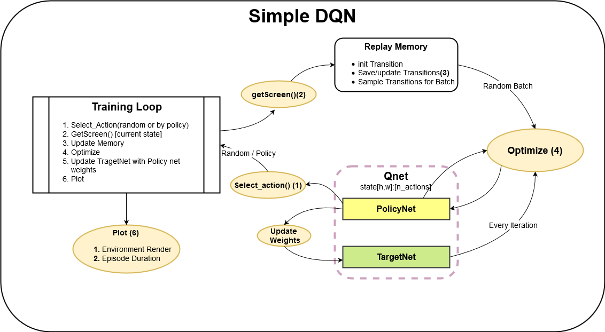
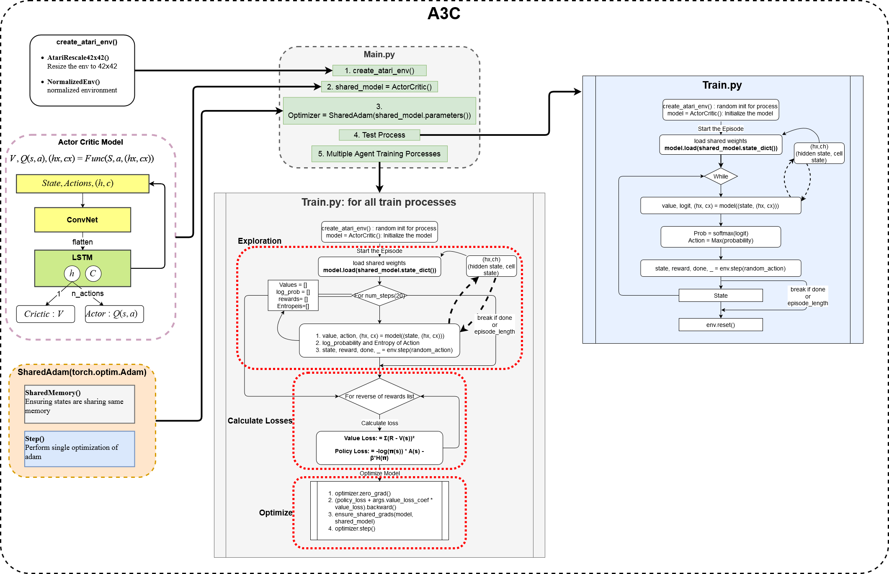

# Assignment P2S8 : DQN on OpenAI Gym

#### Question 1 (50 pts)  
For Part 1:
Upload the screenshot of the program working on your computer (some atari game must be shown).  
**Ans:** 

#### Question 2 (100 pts)  
For part 1:
Share the flow-chart diagram of 11+ functions and the main "for" loop describing the training process and models.  

**Ans:** 

#### Question 3 (350 pts)  
For Part 2:
Share the flow chart diagram for every function for the code https://github.com/ikostrikov/pytorch-a3c (Links to an external site.) (there should be 17+ functions including the main.py considered as function).   
**Ans:**

