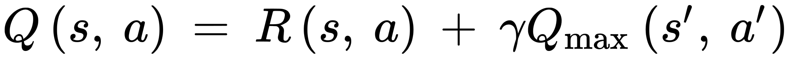

# Twin Delayed DDPG (T3D): Implementation


## Step 0: Initialization

Import Shit: 

* [PyTorch ](https://pytorch.org): For DNN
* [Gym](https://gym.openai.com): Provides reinforcement learning environments. like Atari, MuJoCo, etc 
* [pybullet-gym](https://github.com/benelot/pybullet-gym): Provides physics based environment.

```python
import time
import random
import numpy as np
import matplotlib.pyplot as plt
import pybullet_envs
import gym
import torch
import torch.nn as nn
import torch.nn.functional as F
from gym import wrappers
from torch.autograd import Variable
from collections import deque
```

## Step 2: Define Replay Memory

* An Experience/transition is a tuple of : ***(s, a, s', r)*** :: (current state, action, new state, reward)

  * ***s***: current state of agent
  * ***a***: action taken by agent to move to next state
  * ***s'***: new state after taking action ***a***
  * ***r***: reward received by the agent for taking the action(***a***), from ***s*** to ***s'***
  * **done**: true/1 if the env 'is finished/game over/ or needs a reset'

* Replay Memory is a fixed length array of experiences.

* When agent explores the environment a new experience is added to the Replay Memory.

* When memory is full, we sequentially start replacing the older experiences with new ones from the beginning of the Replay Memory array one at at time.

  

* Then during training, a batch of experiences is sampled randomly to train the agent.

```python
class ReplayBuffer(object):
    def __init__(self, max_size = 1e6):
        self.storage = []
        self.max_size = max_size
        self.ptr = 0

    def add(self, transition):
        if len(self.storage) == self.max_size:
            self.storage[int(self.ptr)] = transition
            self.ptr = (self.ptr + 1) % self.max_size
        else:
            self.storage.append(transition)
    
    def sample(self, batch_size):
        ind = np.random.randint(0, len(self.storage), batch_size)
        batch_states, batch_next_states, batch_actions, batch_rewards, \
                batch_dones = [], [], [], [], []
        for i in ind:
            state, next_state, action, reward, done = self.storage[i]
            batch_states.append(np.array(state, copy = False))
            batch_next_states.append(np.array(next_state, copy = False))
            batch_actions.append(np.array(action, copy = False))
            batch_rewards.append(np.array(reward, copy = False))
            batch_dones.append(np.array(done, copy = False))
        return np.array(batch_states), np.array(batch_next_states), \
                np.array(batch_actions), np.array(batch_rewards).reshape(-1, 1), \
                np.array(batch_dones).reshape(-1, 1)
```

## Step 3: Actor Models

* Actor model:

  * Input:  **State** with size`state_dims` 
  * Hidden layers: Simple DNN with `RelU` activations
  * Output:  **Actions** with size`action_dim`  with `Tanh`, but are clamped by multiplying with a `max_action` value. 

* `max_action` helps limit the action range, even when added gaussian noise while training is too high.

  

```python
class Actor(nn.Module):
    def __init__(self, state_dims, action_dim, max_action):
        # max_action is to clip in case we added too much noise
        super(Actor, self).__init__() # activate the inheritance
        self.layer_1 = nn.Linear(state_dims, 400)
        self.layer_2 = nn.Linear(400, 300)
        self.layer_3 = nn.Linear(300, action_dim)
        self.max_action = max_action
    
    def forward(self, x):
        x = F.relu(self.layer_1(x))
        x = F.relu(self.layer_2(x))
        x = self.max_action * torch.tanh(self.layer_3(x))
        return x
```

## Step 4: Critic Models

* We have two identical critic models, and are defined in the same class with different output variables.

* Each Critic Model:

  * Input:  **State** of size `state_dims` concatenated with the **Actions** of size `action_dim`
  * Hidden layers: Simple DNN with `RelU` activations
  * Output:  **Q value** with size `1`  with no activations.

* **Additionally** a separate copy of first Critic network named `Q1` is also defined. This model will be responsible for calculating the loss and train the Actor model with back-propagation.

* This `Q1` can be defined with second critic or with a weighted average of both critics model too.

  

```python
class Critic(nn.Module):
    def __init__(self, state_dims):
        super(Critic, self).__init__() # activate the inheritance
        # First Critic Network
        self.layer_1 = nn.Linear(state_dims + action_dim, 400)
        self.layer_2 = nn.Linear(400, 300)
        self.layer_3 = nn.Linear(300, 1)
        # Second Critic Network
        self.layer_4 = nn.Linear(state_dims + action_dim, 400)
        self.layer_5 = nn.Linear(400, 300)
        self.layer_6 = nn.Linear(300, 1)
    
    def forward(self, x, u): # x - state, u - action
        xu = torch.cat([x, u], 1) # 1 for vrtcl concatenation, 0 for Hzntl
        # forward propagation on first critic
        x1 = F.relu(self.layer_1(xu))
        x1 = F.relu(self.layer_2(x1))
        x1 = self.layer_3(x1)
        # forward propagation on second critic
        x2 = F.relu(self.layer_4(xu))
        x2 = F.relu(self.layer_5(x2))
        x2 = self.layer_6(x2)
        return x1, x2
    
    def Q1(self, x, u): # x - state, u - action
        # This is used for updating the Q values
        xu = torch.cat([x, u], 1) # 1 for vrtcl concatenation, 0 for Hzntl
        x1 = F.relu(self.layer_1(xu))
        x1 = F.relu(self.layer_2(x1))
        x1 = self.layer_3(x1)
        return x1
```


**CPU or GPU** Small snippet below sets the computation device `GPU` or `CPU` based on availability.

```python
device = torch.device('cuda' if torch.cuda.is_available() else 'cpu')
```


 ## Training our model


## Initializations

* Actor model has two copies of model, 

  * **Actor Model** and **Actor Target** 
  * Weights of Actor Target are same as Actor model.

* Critic Models also have two copies:

  * Weighs of **Critic Targets** are same as corresponding **Critic Models**

  

```python
class T3D(object):
    def __init__(self, state_dims, action_dim, max_action):
        # making sure our T3D class can work with any env
        self.actor = Actor(state_dims, action_dim, max_action).to(device)
        self.actor_target = Actor(state_dims, action_dim, max_action).to(device)
        
        # initializing with model weights to keep the same
        self.actor_target.load_state_dict(self.actor.state_dict)
        self.actor_optimizer = torch.optim.Adam(self.actor.parameters())
        self.max_action = max_action

        self.critic = Critic(state_dims, action_dim).to(device)
        self.critic_target = Critic(state_dims, action_dim).to(device)
        
        # initializing with model weights to keep the same
        self.critic_target.load_state_dict(self.critic.state_dict)
        self.critic_optimizer = torch.optim.Adam(self.critic.parameters())
```


* `select_action` function is used while inference to predict/get the the action,  given a state from the actor model.(policy model)
```python
    def select_action(self, state):
        state = torch.Tensor(state.reshape(1, -1)).to(device)
        # need to convert to numpy, for clipping
        return self.actor(state).cpu().data.numpy().Flatten()
```
## Train Method
* `train()` arguments:
  * `replay_buffer`: replay memory to store/append experiences
  * `iterations`: iterations to train the network
  * `batch_size`: experiences sampled from memory replay
  * `discount`: Discounting factor to calculate Q values
  * `tau`: Polyak Averaging parameter to update target network
  * `policy_noise`: STD of Gaussian noise added to the actions for the exploration purposes
  * `noise_clip`: Max value range for policy_noise from Gaussian distribution.
  * `policy_freq`: Number of iterations to wait before the policy network (Actor model) is updated

## Step 4: sample a batch of transitions (s, s’, a, r) from the memory

* First step of training is to get a random batch of transitions from the **memory replay buffer**
* we also get the value of `done` telling us if the environment needs a reset. i.e. game is over

```python
def train(self, replay_buffer, iterations, batch_size=100, discount=0.99,
        tau = 0.005, policy_noise=0.2, noise_clip=0.5, policy_freq=2):
    for it in range(iterations):
        # Sample from a batch of transitions (s, s', a, r) from the memory
        batch_states, batch_next_states, batch_actions, batch_rewards, batch_dones \
            = replay_buffer.sample(batch_size)
        state = torch.Tensor(batch_states).to(device)
        next_state = torch.Tensor(batch_next_states).to(device)
        action = torch.Tensor(batch_actions).to(device)
        reward = torch.Tensor(batch_rewards).to(device)
        done = torch.Tensor(batch_dones).to(device)
```
## Step 5: Perform Action In The Environment

* While training **actor-target** gives `next_action` ***a*** for given `next_state` ***s'***.

          next_action = self.actor_target(next_state)


## Step 6: Gaussian Noise to Next Action ***a’*** and clamp to a range

- We add Gaussian noise to next action ***a'*** and clamp it between `-max_action` to `+max_action`.

- Helps agent explore the environment and learn faster and better.

  

  

  ```python
      noise = torch.Tensor(next_action).data.normal_(0, policy_noise).to(device)
      noise = noise.clamp(-noise_clip, noise_clip)
      next_action = (next_action + noise).clamp(-self.max_action, self.max_action)
  ```

## Step 7: Q-Values (***TargetQ'1*** , ***TargetQ'2***) From Both Critic Target Networks

* Critic Target networks take in ***s'*** from the batch and ***a'*** from Actor Target output .
* Give us next_target_Q values ***TargetQ'1*** , ***TargetQ'2***


```python
	target_Q1, target_Q2 = self.critic_target.forward(next_state, next_action)
```
## Step 8: Min of (***TargetQ'1*** , ***TargetQ'2***) : ***TargetQ'***

* Target Critic Actors can be too similar due to slow change in policy.
* Using minimum estimation of ***targetQ'***  (target Q_next)among two, solves the overestimation.


```python
	# Keep the minimum of these two Q-Values
	target_Q = torch.min(target_Q1, target_Q2)
```

## Step 9: Calculating ***TargetQ*** from ***TargetQ'***(target Q_next) 

* Mighty Bellman's equation comes to rescue again:



* In TD3: `Qt = r + gamma * min(Qt1, Qt2)`


```python
	# Keep the minimum of these two Q-Values
	target_Q = reward + ((1-done) * discount * target_Q).detach()
```


## Step10: Q-Values from Critic Network

- To calculate the Critic Loss we need Q values from Critic Target and Critic model.
- Target Q-Value has been calculated in last step with Bellman's equation.
- Now, we need Q-values from both the Critic networks to calculate critic loss.


```python
	# Two critic models take (s, a) as input and return two Q-Vales
    current_Q1, current_Q2 = self.critic.forward(state, action)
```

## Step11: Calculating Critic Loss
- Critic Loss is sum of:
  - MSE of **Critic1** Q-value and target-Q
  - MSE of **Critic2** Q-value and target-Q


```python     
        # Compute the critic loss
        critic_loss = F.mse_loss(current_Q1, target_Q) + F.mse_loss(current_Q2, target_Q)
```

## Step 12: Back Propagate Critic Loss


* With calculate loss we can back propagate and update Critic Network parameters.
* 
```python
        self.critic_optimizer.zero_grad() # initializing the gradients to zero
        critic_loss.backward() # computing the gradients
        self.critic_optimizer.step() # performing weight updates
```
## Step 13: Actor Network Back-propagation

* Every second iteration we calculate actor loss and update the actor weights. `policy_freq = 2`

* a forward pass with actor-critic is made:

  * ***a_pred = Actor(s)***
  * ***Q_preds = Critic(s, a_pred)***
  * ***actor_loss = -mean(Q_preds)***

  

* Actor network uses Critic network 1 's output for loss calculation, with its input being ***s*** and actions predicted by actor. 

* As max Q-value is the action taken by the agent, we want to maximize this loss.

* gradient **ASCENT** not **DECENT** by taking negative of Q

  

```python
    if it % policy_freq == 0:
        # This is DPG part
        actor_loss = -(self.critic.Q1(state, self.actor(state)).mean())
        self.actor_optimizer.grad_zero()
        actor_loss.backward()
        self.actor_optimizer.step()
```
## Step 14 & 15: Target Networks Update

* Polyak Averaging is used to update Target networks' weights from their corresponding model networks.

  

* Only a tiny part of old weight value is updated with tiny proportion of corresponding model networks weights.

     ​    W<sub>new</sub> = (tau) W<sub>in</sub> + (1 - tau) W<sub>old </sub>

     

```python
            # Once in every two iterations, we update our Actor Target
            # by Polyak Averaging
            for param, target_param in zip(self.actor.parameters(), self.actor_target.parameters()):
                target_param.data.copy_(tau * param.data + (1 - tau) * target_param.data)
    
            # Once in every two iterations, we update our Critic Target
            # by Polyak Averaging
            for param, target_param in zip(self.critic.parameters(), self.critic_target.parameters()):
                target_param.data.copy_(tau * param.data + (1 - tau) * target_param.data)
```

And we keep going till all iterations are over
